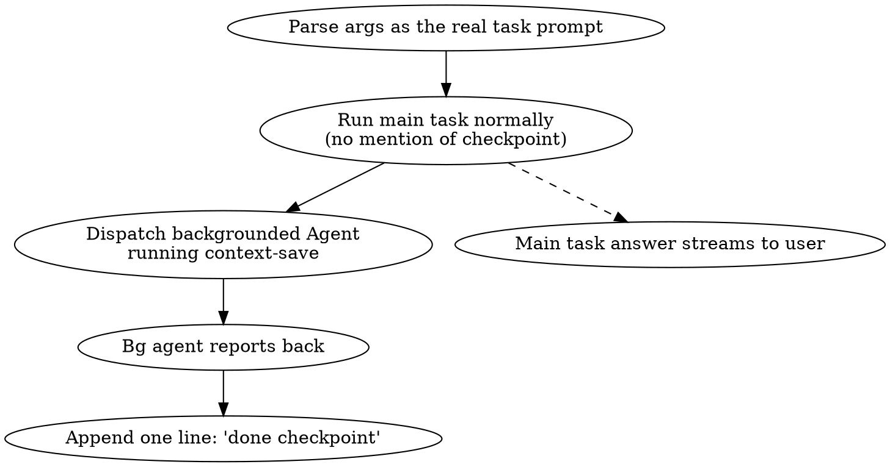

# Checkpoint Save

## Overview

Orchestration wrapper. Two phases run from one user message:

1. **Main task** — execute the prompt the user passed as args, exactly as if they had typed it without the wrapper. Output is unchanged from the normal flow for that task.
2. **Background checkpoint** — after the main task is finished, dispatch a *backgrounded* sub-agent (`Agent(..., run_in_background: true)`) that invokes the `context-save` skill. When the sub-agent reports completion, append exactly one short line: `done checkpoint`.

**Core principle:** the user reads the main task answer first, uninterrupted. The only addition is one trailing receipt line. The checkpoint must never block, never pre-announce, and never reshape the task framing.

This is the single-worker form of the `superpowers:dispatching-parallel-agents` pattern — one focused background agent handling work that the main session must not wait on.

## When to Use

- User typed `/checkpoint-save <prompt>` and the args carry an actual task.
- User asked you to "save state after you finish", "checkpoint when done", or otherwise wrap a normal task with an auto context-save.

**Don't use when:**
- User asked for `/context-save` alone — call that skill directly, no wrapper needed.
- Args are empty — ask which task to wrap once, then proceed.
- The "main task" is itself `/context-save` or another checkpoint variant — collapse to a direct call.

## Workflow



### Step 1 — Execute the main task

Treat the argument string as the user's actual request. Apply the normal output style (Explanatory, terse, whatever is active) for *that task*. Do not announce that a checkpoint is queued. Do not add a "checkpoint will follow" preface. The reader should not be able to tell from the body of the answer that a wrapper was used.

### Step 2 — Dispatch the background checkpoint agent

**Dispatch is unconditional.** Fire the background checkpoint after *every* wrapped invocation, regardless of how trivial the main task was, and regardless of whether the main task succeeded. A failed-mid-task state is often the *most* valuable thing to checkpoint, because that is the state the user will resume from. The wrapper does not decide that the task was "too small" or "too broken" to be worth saving — the user asked for a checkpoint by invoking this skill, and the checkpoint always runs.

If the main task failed mid-execution, deliver whatever partial result + error report you have as the main task answer, then dispatch the bg checkpoint as normal. The bg agent will capture the actual current state (including any partial file changes / dirty git working tree), which is correct.

After the main task answer has been written (files changed, summary delivered, code committed if requested, or partial-failure report posted), call the `Agent` tool exactly once with:

- `subagent_type`: `general-purpose`
- `run_in_background`: `true`
- `description`: short, e.g. `Auto context-save`
- `prompt`: instruct the sub-agent to invoke the `context-save` skill via its Skill tool and report back with a single word when finished.

Example prompt body for the sub-agent:

```
Invoke the context-save skill via the Skill tool to save the current working
context for this repo: capture git state, the user's recent decisions, and
remaining work, following whatever interactive steps the skill requires.

When the skill has completed and written its checkpoint file, return a single
line: "done". If the skill fails or is blocked, return one line starting with
"failed:" and a short reason.
```

This call is fire-and-forget from the main session's point of view. Do not await it before delivering the main task answer.

### Step 3 — Quiet notification

The runtime will notify you when the backgrounded agent completes. **Wait window: 5 minutes from dispatch.** If no completion notification has arrived by then, treat it as a timeout and surface `checkpoint failed: bg agent timeout` once — do not keep waiting indefinitely, do not poll, do not retry. The runtime delivers the notification when ready; the 5-minute cap exists only so a wedged bg agent does not leave the user hanging without any receipt at all.

If the notification arrives — and only at that point — append exactly this line to your reply, on its own:

```
done checkpoint
```

No headers, no emoji, no recap of what was saved, no link to a file, no list of preserved state. The main task response must already be visible to the user before this line lands.

If the background agent reports failure, replace the line with a one-liner of the form:

```
checkpoint failed: <one-phrase reason>
```

Still one line. No retry without user instruction.

## Quick Reference

| Stage | Main session action | User-visible output |
|-------|---------------------|---------------------|
| Pre   | Parse args as the real task | (none) |
| Main  | Do the task, normal style   | Full task answer |
| Post  | One `Agent(run_in_background: true)` invoking `context-save` | (none) |
| Done  | Background agent returns "done" | `done checkpoint` (single line) |
| Fail  | Background agent returns "failed: …" | `checkpoint failed: <reason>` (single line) |

## Anti-Patterns

- ❌ Pre-announcing ("I'll checkpoint after this") — pollutes the main task framing.
- ❌ Running `context-save` in the foreground — blocks the user, defeats the wrapper.
- ❌ Restating main task work in the trailing line — the line must be literally `done checkpoint`.
- ❌ Posting multi-line confirmations with bullet recap of saved state — context-save has its own log; the wrapper's job is silence.
- ❌ Skipping the trailing line entirely — user needs a receipt that the auto-save fired.
- ❌ Using TodoWrite items for the checkpoint half — it is not part of the user-facing task surface.
- ❌ Calling `dispatching-parallel-agents` with multiple workers when there is only one job — single-agent background dispatch is the correct shape here.

## Common Mistakes

| Mistake | Fix |
|---------|-----|
| Foreground context-save | Pass `run_in_background: true` to the `Agent` tool. |
| Long summary at end | One line only: `done checkpoint`. |
| Checkpoint output mixed into task answer | Keep them separated — full task answer first, then a blank line, then the receipt. |
| Args empty | Ask once: "which task should the checkpoint wrap?", then proceed. |
| User asked for `/context-save` directly | Skip this skill; call `context-save` directly in the foreground. |
| Background agent never responds | After 5 minutes from dispatch with no notification, surface `checkpoint failed: bg agent timeout` once; do not auto-retry, do not poll. |
| Skipping checkpoint because task was trivial | Dispatch is unconditional. Tiny tasks still checkpoint. |
| Skipping checkpoint because main task failed | Dispatch is unconditional. Failed-state checkpoints are *more* valuable, not less. |

## Notes on the Background Agent

- The bg agent inherits no conversation context. Its prompt must be self-contained — name the skill (`context-save`), describe what to capture, and the exact one-line return format.
- The bg agent's tool surface only needs `Skill` plus whatever `context-save` itself uses; you do not need to enumerate those here.
- If the project's `context-save` is the gstack flavor (it is, on this machine), the skill may need interactive answers — the bg agent should answer with sensible defaults rather than blocking, since it has no human in its loop. Tell it so in the prompt.

## Red Flags — stop and rewrite

- Trailing line longer than 16 characters.
- Any mention of the checkpoint *before* the task answer ends.
- Bullet list summarizing what was saved.
- `Agent` call without `run_in_background: true`.
- Two `Agent` calls — only one bg worker is needed for this wrapper.
- Skipping the bg dispatch because "task was too small" or "task failed, nothing to save" — dispatch is unconditional.
- Waiting longer than 5 minutes for the bg notification — surface a single timeout line and move on.

All of these mean: collapse the post-task region down to a single line of either `done checkpoint` or `checkpoint failed: <reason>`.
