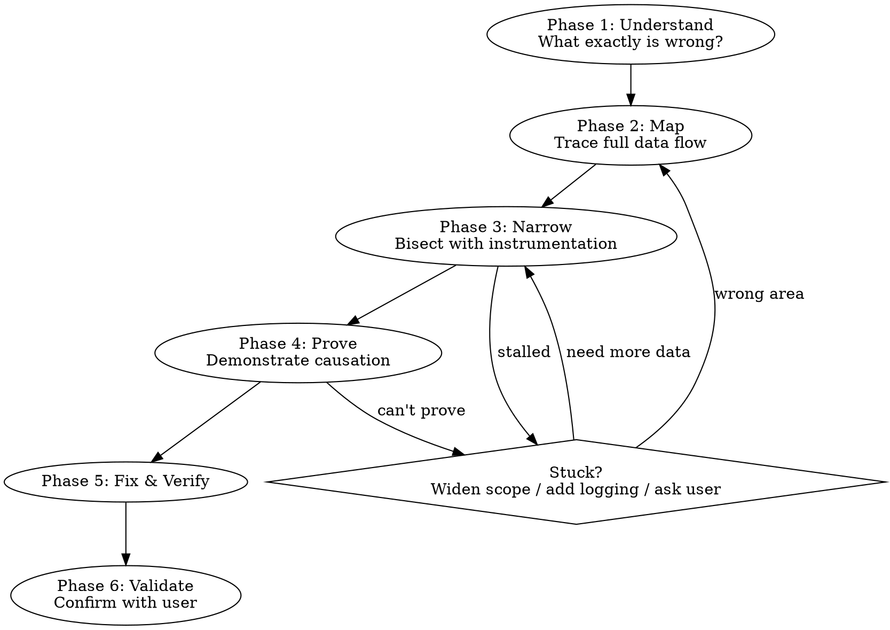

# Deep Investigate

Relentless, evidence-driven investigation for hard problems. Work until root cause is **proven**, not until a hypothesis forms.

**Core principle:** A plausible code path that *could* produce the symptom is NOT evidence that it *does*. Prove causation. Never stop at correlation.

## Response Format for Code & Control Flow (MUST FOLLOW)

**Rule:** Any response that explains or walks through on-disk source code MUST pick one of the two shapes below. **Verbatim full-file/function dumps + a separate numbered prose breakdown are forbidden** — that is the exact failure mode this section exists to prevent. This applies even when the user just says "walk me through X" — that phrasing is not a license to paste the whole function.

### Picker — choose one shape per topic

| If the topic is | Use shape |
|---|---|
| Branching, fan-out, call hierarchy, decision logic, request flow, "what calls what", "which branch wins" | **ASCII tree** (Shape B) |
| A specific transformation, a syntax-dependent bug, or one function's literal behavior | **Inline-narrated code** (Shape A) |
| Cross-service hop sequence | **Arrow chain** `A → B → C` |

If unsure, **default to ASCII tree**. Trees show more structure in less space.

### Shape A — Inline-Narrated Code (when literal lines matter)

MUST follow ALL five rules:

1. **Branch summary above** — one sentence naming the branches/control flow. Do NOT repeat below.
2. **Cmd-clickable anchor** above the block in backticks: `` `/abs/path/file.ext:N` ``. Absolute path, single-line `:N` (NOT `:N-M`), NO markdown link wrapper (`[label](file://...)` is wrong — terminals ignore it).
3. **Prune to ~5–15 lines.** Replace skipped regions with the host language's comment syntax (`// ...` for Go/TS/JS, `# ...` for Python/Shell, etc.). Verbatim full-function dumps are forbidden.
4. **Inline-comment EVERY non-trivial line** explaining WHAT and WHY. Comment syntax matches host language: `//` Go/TS/JS/Rust/Java, `#` Python/Shell/Ruby, `--` SQL/Lua, `;` Lisp. Skip obvious lines (`return x`, plain `if err != nil`).
5. **No post-block 1./2./3. enumeration** that re-narrates the same lines. Post-block prose is reserved strictly for content NOT in the snippet — gotchas, dormant paths, cross-cutting insights, or a small `Input → Output` example for non-trivial transforms.

**✅ Example:**

Three branches: bad-input rejection, not-found rejection, happy path.

`` `/Users/<user>/Developer/<repo>/<path>/foo.ts:42` ``:

```ts
export async function foo({ id }, ctx) {
  // Guard: reject empty id before any RPC
  if (!id) throw new Error('bad input')
  // Fetch from downstream service
  const result = await ctx.svc.fetch(id)
  // Empty = not found; throw so callers don't get a silent null
  if (!result) throw new Error('not found')
  return result
}
```

### Shape B — ASCII Tree / Flow Diagram (when structure matters)

MUST follow ALL four rules:

1. **Box-drawing chars** `├──` `└──` `│` for hierarchy. Arrows `→` `↓` for sequence. Fenced ASCII block, NO markdown bullets, NO bold-headed paragraphs.
2. **Inline `#` comments** on each node, explaining what it does or which branch it represents. Use `#` regardless of host language — this is a diagram, not source code.
3. **Decision branches** labeled `├── yes → <action>` / `└── no → <action>`. Predicate goes on the parent node; child nodes carry the resolved action.
4. **Short nodes — one line each.** Function name + one-phrase intent. No paragraphs, no multi-sentence nodes.

**✅ Example — call fan-out:**

```
GetPersonnel(userId)
├── komrade.GetUser(target)          # identity lookup
│   └── komrade.GetUser(supervisor)  # only if target.supervisor set
├── records.GetPersonnelEntities     # user + personnel entity
│   ├── BatchGetBranchEntities       # by user id
│   └── BatchGetRelated              # follow UserPersonnel edge
└── makePersonnelProfile
    ├── userEntity == nil      → auto-provision both
    ├── personnelEntity == nil → auto-provision personnel only
    └── both present           → composePersonnel + access mask
```

**✅ Example — decision tree:**

```
caller whitelisted?
├── yes → return full access map, done
└── no
    ├── caller.UserID == nil → InvalidInputError
    └── load caller groups + CH tree
        └── compute access mask via Euler-tour ancestry
```

### Red Flags — STOP and rewrite

- ❌ Code block with zero `//` (or `#`) comments + a paragraph below restating it in English.
- ❌ Code block followed by `1. … 2. … 3. …` re-narrating the same lines.
- ❌ Anchor uses relative path, range syntax (`:172-176`), or `[label](file://...)` markdown link wrapper.
- ❌ Anchor is the function name alone (`` `convertPersonnel` (lines 132–141) ``) instead of the absolute file path with `:N`.
- ❌ Branching/fan-out rendered as 5 separate code blocks instead of one tree.
- ❌ Decision logic rendered as bold-headed paragraphs (`**Input: X == nil**`) instead of a labeled tree.
- ❌ Tree nodes use `[brackets]` instead of `#` for inline comments.
- ❌ Verbatim file paste — every line of the function included regardless of relevance.

### When neither shape applies

Skip both shapes only for: copy-paste configs, API request/response shape examples, minimal repros where individual lines have no meaning, one-line commands, generated artifacts. For these, keep the block clean and narrate above.

## The Three Laws

1. **Work until done.** Don't stop at hypothesis. Don't stop at "this looks like it could cause it." Keep going until fix is verified and user confirms.

2. **Never assume.** Missing context → ask. Think you know what a function does → read it. Think you know the data shape → log it. Fill gaps with evidence, not guesses.

3. **Prove, don't pattern-match.** Finding code that *could* produce similar symptoms is a *lead*. You must demonstrate that the specific code path is actually triggered in the failing scenario with the actual wrong values.

## Investigation Flow



## Phase 1: Understand the Problem

Before touching code — define what's actually wrong.

1. **Reproduce** — Can you trigger it? Exact steps? Every time or intermittent?
2. **Define the delta** — Actual behavior vs expected behavior. Be precise, not vague.
3. **Scope** — One case, many, all? When did it start? What changed recently?
4. **Gather missing context** — Can't answer above? **ASK THE USER.** Don't fill gaps with assumptions.

```bash
# Parallel data gathering
git log -20 --oneline
git status --short
git diff --stat
```

**Exit gate:** Can state problem in one precise paragraph: what happens, what should happen, when it started.

## Phase 2: Map the System

Understand the code paths BEFORE forming any hypothesis.

1. **Trace the happy path** — Read the actual code. Not descriptions, not comments — the code itself. Trace data flow entry to exit.
2. **Identify all components** — Every file, function, service, query in the chain.
3. **Find boundaries** — Where data crosses component boundaries = most common failure points.
4. **Read, don't assume** — When you think you know what a function does: read it. When you think you know the data shape: log it.

For each component in the chain:
- What data enters?
- What transformation happens?
- What data exits?
- What assumptions about inputs?

**Exit gate:** You have a complete mental model of the data flow. You can name every component in the chain.

## Phase 3: Narrow Down

Systematically eliminate. Don't guess — bisect.

1. **Add instrumentation** — `console.log` / structured logging at component boundaries. Verify what actually runs, not what you think runs.
2. **Bisect** — Data correct entering component X? Yes → bug is after X. No → bug is before X. Move probe, repeat.
3. **One variable at a time** — Change/test/verify ONE thing. Never batch changes.
4. **Track verified facts:**
   - ✅ Data correct at point A (verified by: [how])
   - ✅ Data correct at point B (verified by: [how])
   - ❌ Data wrong at point C (verified by: [how])
   - → Bug is between B and C

**Exit gate:** Narrowed to specific location where correct data enters and incorrect data exits.

## Phase 4: Prove Root Cause

You have a suspect. Now **prove** it — not "it looks like" but "I verified."

1. **Demonstrate causation** — Show THIS code, with THIS input, produces THIS wrong output. Actually execute it. Not "could produce" — DOES produce.
2. **Explain the mechanism** — WHY does this code fail? The logical reason, not just the line number.
3. **Minimal reproduction** — Can you write a test that fails for this specific cause? If you can't reproduce in isolation, you haven't proven it.
4. **Rule out alternatives** — Could something ELSE also cause this? Explicitly disprove, don't just ignore.

**Exit gate:** "Root cause is [X] because [evidence]. Verified by [specific test/observation]. Ruled out [alternatives] by [how]."

## Phase 5: Fix and Verify

Now — and ONLY now — fix.

1. **Fix at source** — Fix where bug originates, not where symptom appears.
2. **Minimal change** — Fix the bug. Don't refactor. Don't clean up.
3. **Verify** — Run reproduction. Pass? Other tests still pass? Feature works?
4. **Fix matches diagnosis** — If you said "bug is X" but fixed Y, something is wrong.

## Phase 6: Validate Completeness

Before declaring done:

1. Re-run original reproduction scenario
2. Check edge cases — fixed one case but left similar ones broken?
3. Run related tests for regressions
4. Confirm with user — "Root cause was [X]. Fixed by [Y]. Evidence: [Z]. Does this match what you saw?"

## RED FLAGS — STOP IMMEDIATELY

If you catch yourself doing ANY of these, you are about to fail the investigation:

| Red Flag | What to do instead |
|----------|-------------------|
| "This code path could produce this symptom, so this is the bug" | **LEAD, not conclusion.** Prove it IS triggered. Add logging. Trace actual execution. |
| "The root cause is clear" (before reading actual code) | Nothing is clear until you've read and traced the code. Slow down. |
| "I found something similar, this must be it" | Similar ≠ same. Verify this specific path runs in this specific case. |
| "I think the issue is..." (without evidence) | Replace "I think" with "I verified by [action] that..." |
| "Based on my analysis of the code..." (without executing) | Static analysis alone is insufficient. Run it. Log it. Watch it. |
| "Let me propose a fix for what I found" (before proving cause) | Premature. Go back to Phase 3/4. |
| Listing multiple possible causes | Pick one, prove or disprove, move to next. Serial, not parallel. |
| Summarizing findings and stopping before problem is solved | You're not done. Keep working. |
| "I'm pretty confident" / "most likely" / "probably" | Confidence without evidence = guessing. Prove it. |
| Reasoning from file descriptions instead of reading actual source | Descriptions omit edge cases and runtime behavior. Read the code or ask for access. |
| Found an existing fix/commit and reverse-engineered the explanation | Verify independently. An existing fix may be incomplete or wrong. Prove the root cause yourself. |

**All of these mean: You have a LEAD, not a CONCLUSION. Keep investigating.**

## When You Can't Access Code

If you only have descriptions, summaries, or secondhand accounts of the code — **say so explicitly.** Don't reason from descriptions as if you read the source. Instead:

1. State: "I haven't read the actual implementation. I need access to [specific files] to investigate."
2. Ask for file contents, repo access, or permission to read.
3. Do NOT form conclusions from descriptions alone — they omit edge cases, branching logic, and runtime behavior that are critical to debugging.

Reasoning from descriptions is pattern-matching by definition. It violates Law 3.

## When You're Stuck

1. **Widen scope** — May be looking at wrong part. Re-examine Phase 2 assumptions.
2. **Add more instrumentation** — Can't tell what's happening → need more visibility.
3. **Ask the user** — "I've narrowed to [area] but need [specific thing] to proceed."
4. **Change angle** — Trace backward from symptom instead of forward from trigger. Add runtime logging instead of reading code.

**NEVER:**
- Conclude without proof
- Propose multiple possible causes and ask user to pick
- Give up and suggest workaround before proving root cause
- Summarize "findings" that are just hypotheses
- Stop working because you've been investigating "a while"
- Present an existing fix/commit as your investigation result — if a fix exists, verify it's correct independently

## Anti-Pattern Table

| Anti-Pattern | Why wrong | Do this instead |
|-------------|-----------|-----------------|
| **Pattern matching** — "This code looks like it could cause it" | "Looks like" ≠ "does cause." Thousands of paths *could* fail. | Instrument. Prove this path executes with wrong values. |
| **Premature conclusion** — Find plausible bug on first path explored, declare victory | Explored ONE path. Haven't proven it's THE path. | Reproduce. Show data flowing through this exact path. |
| **Shotgun listing** — "Here are 5 things that might be wrong" | Listing is not investigating. It's avoiding the hard work. | Pick most likely, prove or disprove, next. Serial. |
| **Assumption cascades** — "If A, and B, then C must be the bug" | Each assumption has uncertainty. Three compound to unreliable. | Verify A independently. Then B. Then C. |
| **Static analysis only** — Read code, reason about it, never execute | Code does what it does, not what you think. | Run it. Log it. Watch it. |
| **Stopping at plausible** — Find reasonable explanation, stop | Plausible explanations are cheap. Proven causes are valuable. | Ask: "Have I PROVEN this, or does it just sound right?" |

## Rationalization Table

| Excuse | Reality |
|--------|---------|
| "The root cause is clear from the code" | If you didn't execute/instrument, you're pattern-matching. Read ≠ verify. |
| "I've investigated thoroughly" | Did you PROVE the cause, or just explore? There's a difference. |
| "I'm pretty confident this is it" | Confidence without evidence is guessing. Add logging and verify. |
| "There are multiple possible causes" | Then investigation isn't done. Narrow down. |
| "This is the most likely cause" | Likely ≠ proven. Keep going. |
| "I need to propose a fix to test my theory" | No — verify with instrumentation first. Fixes follow proof. |
| "Further investigation needs [thing I don't have]" | Ask the user for it. Missing context isn't an excuse to stop. |
| "The investigation has been extensive" | Duration ≠ proof. Extensive ≠ conclusive. |
| "I can see from the logic that..." | Seeing logic ≠ verifying execution. Instrument and run. |

## Self-Check Before Concluding

Before presenting root cause, pass this gate:

- [ ] Did I **read the actual code**, not just descriptions or comments?
- [ ] Did I **execute or instrument** to verify runtime behavior?
- [ ] Did I **prove** this code path triggers in the failing case, not just *could* trigger?
- [ ] Did I **rule out** alternative causes with evidence?
- [ ] Can I state root cause as "Verified by [specific action] that [specific thing happens]"?
- [ ] Did I **reproduce** the bug with a minimal test case?
- [ ] Does my fix **match** my stated root cause?

If any box is unchecked: **you're not done. Keep investigating.**

## Related Skills

- **superpowers:systematic-debugging** — 4-phase debugging framework. Deep-investigate extends it with stricter evidence requirements and anti-pattern-matching enforcement.
- **context-save** — Checkpoint investigation state during long sessions. Use when switching tasks or ending session mid-investigation.
- **clickable-file-anchors** — Formal spec for the cmd-clickable anchor format used in Shape A above. Loaded automatically when this skill applies.
