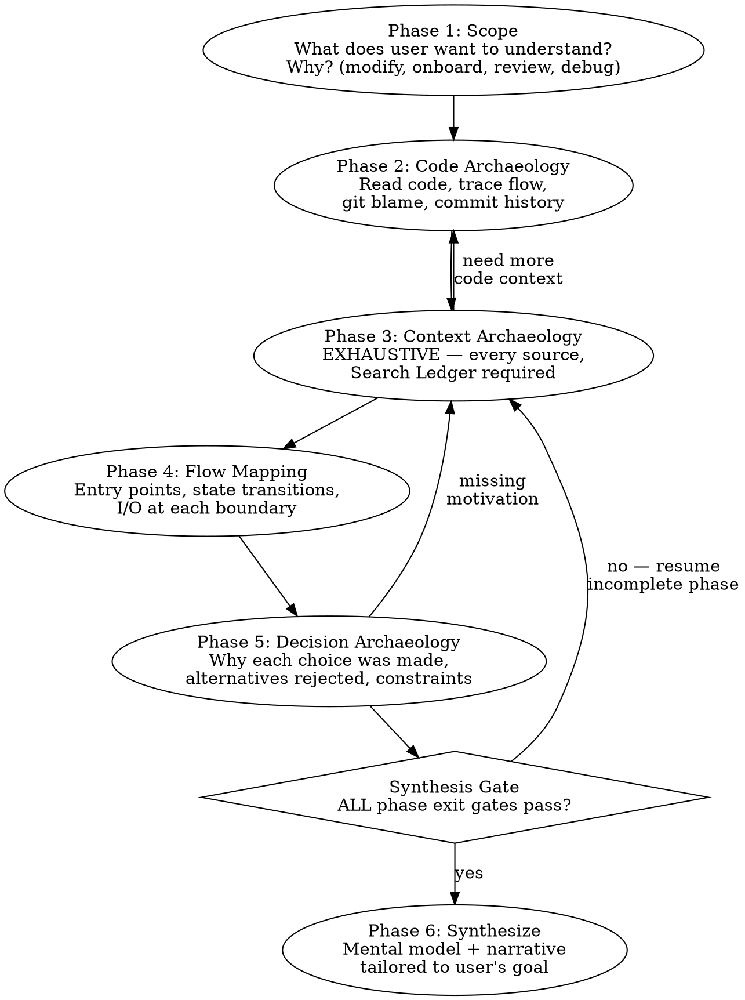

# Deep Understand

Produce deep understanding of existing code and systems — not just WHAT it does, but WHY it exists, HOW it got here, and WHAT shaped its design.

**Core principle:** Code is the artifact. Understanding requires the story — the business problem, the design choices, the constraints, the evolution. Reading code tells you what; archaeology tells you why.

**Iron rule:** This skill is exhaustive by definition. "Quick understanding" is a different request — point the user at a different skill, narrow the scope, or warn them this will take real time. Never silently shortcut Phase 3.

## The Three Questions

Every investigation must answer:

1. **Why does this exist?** — What business problem, bug, edge case, or requirement motivated it? Not "what does it do" but "what would break or be impossible without it?"
2. **How does it flow?** — What is the entry point? What data enters, transforms, exits at each step? What are the state transitions?
3. **What shaped it?** — What decisions were made and why? What alternatives were rejected? What constraints (bugs, edge cases, side effects, backwards compatibility) forced specific choices?

## Investigation Flow



## What Counts as "Significant" (No Cherry-Picking)

Phase 2, 3, and 5 require coverage of every **significant** block of code or design choice. Significant is not subjective — it is anything matching ANY of:

- Has a non-trivial branch (if/switch with >1 non-default arm, ternary chain, error path)
- Mutates external state (DB write, network call, global, ref, file system)
- Has explanatory comments, TODOs, HACKs, FIXMEs, WORKAROUND markers, or NOTE annotations
- Touches auth, permissions, billing, PII, partner gating, or feature flags
- Has a dedicated test or appears in a test name
- `git blame` shows >1 author or >2 modifications across its lifetime
- Is referenced by name in any PR, Jira ticket, design doc, or Slack thread you found
- Contains magic numbers, string literals that look like keys/IDs, or values whose origin is non-obvious

If any of those are true, the block is significant. Document the WHY for it. No skipping "obvious" ones — obvious to you ≠ obvious to the next reader, and "obvious" is exactly where wrong assumptions hide.

## Phase 1: Scope the Understanding

**Before touching code — understand what the user needs.**

Ask (one at a time, not all at once):

1. **What specifically?** — A function? A feature? A system? A design pattern? Narrow the target.
2. **Why now?** — Are they modifying it? Onboarding? Reviewing? Debugging? This changes what depth and angle matters.
3. **What do they already know?** — Don't explain what they already understand. Build on existing knowledge.

If the user's request is already specific enough (e.g., "explain shouldShowFormCard and why it exists"), skip to Phase 2 — but still note whether the goal is modify/onboard/review/debug, because it shapes the synthesis.

If the user asks for "quick" or "brief" understanding and the target is non-trivial, push back: deep-understand is exhaustive. Offer (a) narrowing the scope to one specific question, or (b) using a lighter skill. Do not silently truncate.

**Exit gate:** You can state in one sentence: "User wants to understand [X] because [they're doing Y]."

## Phase 2: Code Archaeology

Read the actual code. Then read the history.

### 2a: Read the Code

1. **Find the code** — Grep/glob for the target. Read the actual implementation, not descriptions.
2. **Read callers** — Who calls this? What context provides the inputs?
3. **Read callees** — What does this call? What side effects?
4. **Read types** — What types constrain the inputs and outputs?
5. **Read tests** — Tests reveal intended behavior, edge cases the author knew about, and the contract.

### 2b: Read the History

```bash
# Who wrote this and when?
git log --follow -p -- <file>

# Original introduction
git log --diff-filter=A -- <file>

# Blame specific lines for authorship
git blame -L <start>,<end> <file>

# What changed recently?
git log --oneline -20 -- <file>

# Find the PR that introduced key changes
git log --grep="<keyword>" --oneline
```

For every significant block of code, know:
- **When** was it written?
- **Who** wrote it?
- **What commit message / PR title** describes the intent?
- **What changed** from the previous version?

**Exit gate:** You can describe what the code does, who wrote each significant part, and when. List of every significant block (per the criteria above) is enumerated — not a sample.

## Phase 3: Context Archaeology — EXHAUSTIVE

**This is the phase most agents skip or sample. Don't. It is the core of the skill.**

Code and git history tell you WHAT happened. Context archaeology tells you WHY.

### Hard gate: Exhaustive source enumeration

The previous version of this skill said "at least TWO". That floor became a ceiling — agents stopped after two and produced shallow answers. Forbidden going forward.

**You MUST attempt EVERY available source in the table below.** Not a subset. Not "the most likely two". Every one. The unsearched source is statistically where the contradicting fact lives — that is the entire reason the skill exists.

| # | Source | Tool | Required action |
|---|--------|------|-----------------|
| 1 | Git history (introduction commit + every modification) | `git log --follow -p`, `git blame`, `git log --diff-filter=A` | Read every commit message touching target. List authors. |
| 2 | PRs (every commit's PR + topic search) | `gh pr list --search`, `gh pr view`, `gh api repos/.../pulls/N/comments` | Read every PR description + review threads + inline comments. |
| 3 | Jira (every ticket referenced in commits/PRs + topic/feature/function-name search) | `searchJiraIssuesUsingJql`, `getJiraIssue` (whichever Jira MCP is available in the session) | Read ticket + parent epic + every comment. Capture acceptance criteria. |
| 4 | Confluence / design docs | Confluence search MCP (`searchConfluenceUsingCql` or equivalent) | Search by feature name, system name, every ticket ID found. |
| 5 | Quip | `mcp__claude_ai_Quip__search_documents`, `read_document` | Search by feature name, function name, every ticket ID found. |
| 6 | Slack / Glean / company knowledge search | Glean MCP (`search`, `chat`) or equivalent | Search by feature, function, ticket ID, error messages, author name. |
| 7 | Code comments and TODOs (target file + neighbors + callers/callees) | `grep -n "TODO\|HACK\|WORKAROUND\|NOTE\|XXX\|FIXME"` | Read every annotation. |
| 8 | Tests (target's tests + sibling tests + integration tests that exercise the path) | Read | Every test name + body — they encode the contract and the edge cases. |
| 9 | Related code (callers + callees + sibling implementations of the same pattern) | grep, read | Map relationships. Compare with similar code elsewhere. |

A row counts as **attempted** only when ALL three are true:

1. A real query was executed (not just contemplated).
2. The result was inspected — every hit if ≤10, top 10 + a sample of the rest if >10. "0 hits" is a valid result and you log it.
3. The query was varied if the first attempt returned nothing useful. Try at least 3 variants per source: ticket ID, feature name, function/symbol name, file path, related concepts. One-shot queries do not count.

If a tool is unavailable (MCP error, no auth, server down), you log the failure with the exact error, and you must still attempt the remaining sources. You may not skip the row — you mark it "unavailable: <reason>" and move on. Treat unavailability as a known limitation in the synthesis, not a permission to drop the source from consideration.

### Search Ledger (required artifact)

Build and maintain this table as you search. Phase 4 is **blocked** until the ledger has an entry for every row of the source table above. Show the ledger to the user (or include it in your internal scratchpad if it would clutter the chat) — but it must exist.

| Source | Query/queries used | Hits | Key findings | Status |
|--------|-------------------|------|--------------|--------|
| Git log | `git log --follow -p src/foo.ts` | 14 commits | RMS-1234 introduced; RMS-5678 fixed null crash | done |
| PR search | `gh pr list --search "shouldShowFormCard"`; `gh pr view 4521` | 3 PRs | #4521 added Standards gating | done |
| Jira | RMS-1234, parent EPIC-99, JQL `text ~ "form card"` | 4 tickets | Original requirement: hide cards for partial schemas | done |
| Quip | "form card visibility"; "shouldShowFormCard"; "RMS-1234" | 1 doc | Design decision rationale on partial schemas | done |
| Slack/Glean | `chat: "shouldShowFormCard rationale"`; `search: "RMS-1234"`; `search: "form card visibility"` | 0 | Nothing relevant | done (empty) |
| Confluence | `cql: text ~ "shouldShowFormCard"`; `text ~ "form card schema"` | 0 | Nothing relevant | done (empty) |
| Code comments | `grep -rn "TODO\|HACK\|WORKAROUND\|FIXME"` in module | 2 | TODO on alt-path edge case | done |
| Tests | `*.spec.ts` for target + siblings | 7 tests | Contract enumerated by test names | done |
| Related code | grep for similar pattern callers | 5 sites | Pattern reused in Records module | done |

Empty result ≠ skipped. An empty row is documented evidence that the source has nothing to add. That is itself a finding.

### What to look for in each source

- **Business requirement** — What did stakeholders ask for?
- **Bug report** — Was this a fix? What was broken?
- **Edge case** — What specific scenario forced this design?
- **Constraint** — What technical/business limitation shaped this?
- **Alternative considered** — What was rejected and why?
- **Timeline pressure** — Was this a quick fix intended to be temporary?
- **Author intent** — In their own words from PR, ticket, or Slack.

### Exit gate

For each significant block (per the objective definition above), you have either:

- An evidence-backed WHY: "This exists because [reason], documented in [source link]." OR
- An "exhausted, none found" with the Search Ledger as proof — every row attempted with ≥3 query variants.

Below that bar, "couldn't find" = "didn't try hard enough". Resume searching.

## Phase 4: Flow Mapping

Map how data flows through the system. For each component in the chain:

### Entry Points
- Where does execution start?
- What triggers this code path? (user action, API call, timer, event)
- Under what conditions is this path taken vs skipped?

### State Transitions
For each boundary between components, document:

```
[Component A] --→ [Component B]
  Input: { what data enters }
  Transform: { what changes }
  Output: { what data exits }
  Side effects: { state mutations, API calls, events emitted }
  Conditions: { when this path is taken }
```

### Key Questions at Each Boundary
- What assumptions does the receiving component make about its input?
- What happens if the input is unexpected (null, empty, wrong type)?
- Where are the error boundaries?
- What state is shared vs isolated?

**Exit gate:** You can trace any input from entry point through every component to final output, naming what transforms at each step. Every significant block from Phase 2 appears somewhere on the flow map.

## Phase 5: Decision Archaeology

For each significant design choice discovered:

1. **What was the decision?** — Describe the choice that was made.
2. **Why was it made?** — Business requirement? Bug fix? Performance? Compatibility?
3. **What alternatives existed?** — What else could have been done?
4. **Why were alternatives rejected?** — Technical limitation? Time pressure? Edge case?
5. **What are the consequences?** — What does this choice force downstream?
6. **Is this still the right choice?** — Has context changed since the decision was made?

### Escape hatch — narrow conditions only

You may write "no documented reasoning found" ONLY when ALL of:

- Search Ledger shows real attempts on every row (1–9).
- Each source was queried with ≥3 query variants (ticket ID, feature name, function/symbol name, file path, related terms).
- You searched commit messages of the original introduction commit AND each subsequent significant modification.
- You attempted to identify the author and checked their other commits/PRs from ±60 days of the change for context.
- You looked for sibling implementations of the same pattern elsewhere in the codebase that might explain the convention.

Below that bar, "couldn't find" = "didn't try hard enough". Keep searching.

When you do invoke the escape hatch, write it like this:
> "No documented reasoning found for [choice], despite Search Ledger showing exhausted attempts on all 9 sources (see ledger). Based on the code and timeline, likely motivated by [hypothesis] — but this is inference, not evidence."

**Never present inference as fact.**

## Synthesis Gate

Do **not** emit any mental model, summary, partial answer, or "here's what I think" until ALL of these are true:

- [ ] Phase 1 scope statement written (one sentence)
- [ ] Phase 2 list of every significant block enumerated (objective definition)
- [ ] Phase 2 history read for every significant block (when, who, what changed, why per commit message)
- [ ] Phase 3 Search Ledger has an entry for every row 1–9, status `done` or `unavailable: <reason>`
- [ ] Phase 3 each ledger row used ≥3 query variants (or documented why fewer were possible)
- [ ] Phase 4 flow map drawn (entry → transitions → exit, with I/O at each boundary)
- [ ] Phase 5 decision table complete — every significant choice has WHY + evidence link, OR explicit escape-hatch invocation backed by ledger

Skipping any precondition produces the wrong mental model. Do not negotiate this with yourself. The user gets a useless answer faster — that is not a win.

## Phase 6: Synthesize

Produce understanding **interactively**, not as a wall of text.

### Delivery approach

1. **Start with the Mental Model** — present the conceptual model first (1-3 paragraphs max). This is the "here's how to think about this" framing.
2. **Ask before going deeper** — "Want me to go deeper into [the flow / the decision history / the edge cases / how to modify it safely]?" Let the user direct which sections matter to them.
3. **Expand on request** — deliver the sections the user asks for. Skip what they don't need.

This mirrors brainstorming's "one thing at a time, get feedback" pattern. A 2000-word dump is less useful than a focused mental model + directed deep dives.

### Structure the output (when expanding)

1. **Mental Model** (most important) — "Here's how to think about this system." Not code walkthrough, but the conceptual model. Analogies welcome. This should let someone reason about behavior without reading code.

2. **Why It Exists** — The business problem, in non-code terms. What would be impossible or broken without this?

3. **How It Works** — The flow, with entry points and state transitions. Reference specific files:lines but explain in human terms.

4. **What Shaped It** — The key decisions, constraints, and evolution. Timeline of major changes with motivation for each.

5. **Edge Cases and Gotchas** — The non-obvious behaviors, the "watch out for this" warnings. Especially: things that look wrong but are intentional, and things that look intentional but are accidental.

6. **If You're Changing This** — (only if user's goal involves modification) What would break? What assumptions do callers make? What tests cover this? Where are the landmines?

### Tailor depth to goal

| User goal | Emphasize |
|-----------|-----------|
| **Modifying** | Flow, edge cases, caller assumptions, test coverage, "if you change X then Y breaks" |
| **Onboarding** | Mental model, why it exists, how to think about it, where to look |
| **Reviewing** | Decisions, alternatives, risk areas, what changed and why |
| **Debugging** | Flow, state transitions, where data transforms, boundary conditions |

## Rationalization Table — STOP if You Think These

| Excuse | Reality |
|--------|---------|
| "Found enough sources to answer" | Enough ≠ all. The unsearched source is statistically where the contradicting fact lives. Keep going. |
| "User just wants a quick summary" | If they wanted a quick summary, this skill is the wrong tool. Tell them. Don't silently shortcut. |
| "Diminishing returns from more searches" | You don't know what you'd find until you search. Predicting empty without querying is guessing. |
| "Other sources unlikely to have anything" | Unlikely ≠ zero. Run the query, log empty, move on. Cost: 30 seconds. |
| "Code is self-explanatory here" | Then why does it exist? Self-explanatory ≠ motivated. Find the WHY. |
| "I'll fill the gap with reasonable inference" | Inference presented as fact = lying to the user. Either find evidence or label inference explicitly per the escape hatch. |
| "Two sources agree, that's enough" | Two sources can both be wrong (copy-paste, shared author, propagated assumption). Triangulate from independent sources. |
| "Phase 3 is taking too long" | Phase 3 IS the work. Skipping it = delivering a useless answer faster. The user gets nothing of value. |
| "Newest commit explains it" | Newest = current state. Original introduction + intermediate changes explain WHY it evolved into the current state. Read all. |
| "Author left the company / unavailable" | Their PRs, tickets, Slack history, Quip docs persist. Search them. Their absence is not your excuse. |
| "Already wrote a draft mental model in my head" | Drafted before ledger complete = wrong. Erase. Build the model on evidence, not the reverse. |
| "I'll skip the empty rows in the ledger" | Empty rows are evidence. The ledger is a contract with the reader that you actually looked. Skipping = lying. |
| "One query variant per source is fine" | One keyword = one angle. The fact you missed lives at a different angle. Run ≥3. |
| "Tests don't count as a source" | Tests encode the contract and the edge cases the author cared about. They count. Read them. |
| "It's clear from context, no need to confirm" | "Clear from context" is exactly the assumption that turns out wrong. Confirm. |

## RED FLAGS — Stop and Course-Correct

| Red flag | What to do |
|----------|-----------|
| Explaining WHAT code does without WHY | Stop. Resume Phase 3 (context archaeology). |
| No external sources checked | You skipped Phase 3. Resume. Build the Search Ledger from scratch. |
| Search Ledger has fewer than 9 rows attempted | Stop. Resume Phase 3 until every row has a status. |
| Any ledger row marked `done` without a real query in the row | Lying to yourself. Run the query. Update the row with actual evidence. |
| Used same single keyword for every source | Vary queries — ticket ID, feature name, function name, file path, related concepts. ≥3 variants per source. |
| "I think the reason is..." without evidence | Label as inference per the escape hatch, only if Search Ledger is exhausted. Otherwise keep searching. |
| Describing code line by line | Stop. Synthesize a mental model instead. Phase 6 is "how to think about it", not "what each line says". |
| No entry points identified | Resume Phase 4. Trace from user action to this code. |
| No state transitions mapped | Resume Phase 4. What enters and exits each component? |
| Started writing mental model before Synthesis Gate passed | Stop writing. Finish the gate checklist. The model is wrong without it. |
| Cherry-picked easy decisions, skipped hard ones | Re-list significant blocks objectively (per the criteria). Force a WHY for every one. |
| User pushing for faster answer | Tell them: deep-understand is exhaustive by definition. Offer narrower scope or a different skill. Do not silently shortcut. |
| Answering a different question than the user asked | Resume Phase 1. Re-read the user's actual question. |
| Producing output before checking external sources | Phase 3 is mandatory. Build the Search Ledger first. |

## When External Sources Are Unavailable

If you cannot access Jira, Slack, Glean, Quip, Confluence, or other tools:

1. **Say so explicitly, per source** — "Jira MCP unavailable in this session: <error>." One line per unavailable source.
2. **Still attempt every available source.** Unavailability of one source does not excuse skipping the others.
3. **Mark unavailable rows in the Search Ledger as `unavailable: <reason>`** — they remain in the ledger, not deleted. The ledger is a record of what was attempted, including failures.
4. **Maximize what you have** — Git history, PR descriptions, code comments, README/docs, test names, related code patterns.
5. **Label inference clearly** — "Based on the commit timeline and PR title, this appears to be motivated by [X] — but I haven't verified with the original ticket because Jira MCP was unavailable."
6. **Tell the user what to verify** — "To confirm the motivation, look at [Jira ticket RMS-####] or ask [author name]."

Unavailability is a documented limitation, not a permission to deliver shallow understanding.

## Related Skills

- **deep-investigate** — Use when the goal is to find and fix a bug, not to understand a system. Deep-investigate proves causation; deep-understand builds mental models.
- **brainstorming** — Use when the goal is to design something new. Deep-understand is for understanding what already exists.
- **context-save** — Checkpoint deep-understand findings during long sessions. The Search Ledger and decision table are exactly what should be persisted.
