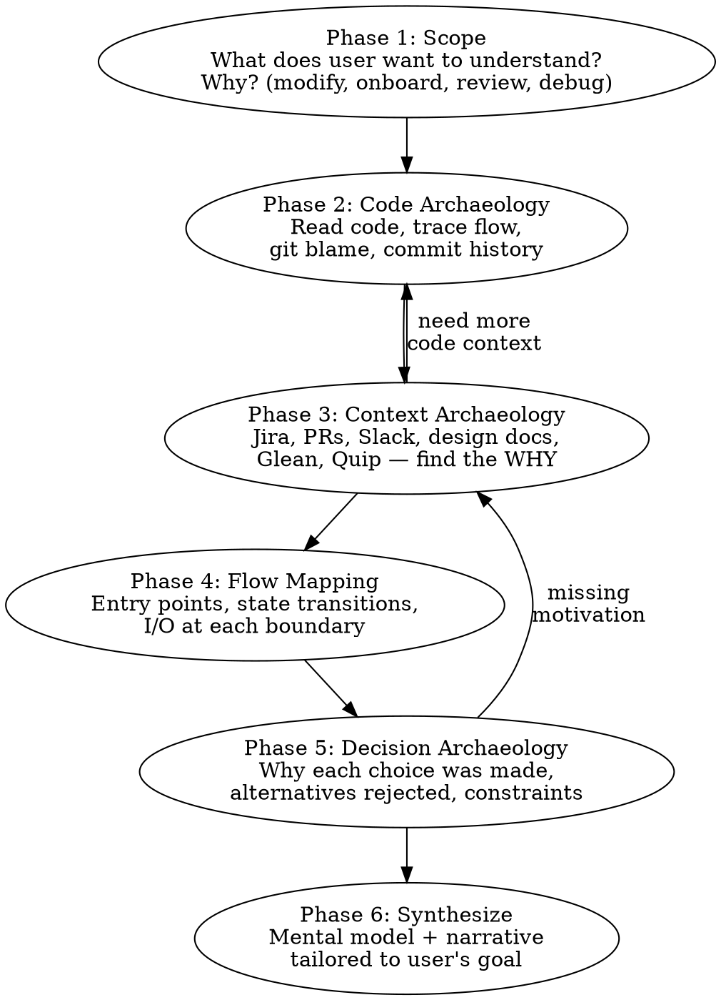

# Deep Understand

Produce deep understanding of existing code and systems — not just WHAT it does, but WHY it exists, HOW it got here, and WHAT shaped its design.

**Core principle:** Code is the artifact. Understanding requires the story — the business problem, the design choices, the constraints, the evolution. Reading code tells you what; archaeology tells you why.

## The Three Questions

Every investigation must answer:

1. **Why does this exist?** — What business problem, bug, edge case, or requirement motivated it? Not "what does it do" but "what would break or be impossible without it?"
2. **How does it flow?** — What is the entry point? What data enters, transforms, exits at each step? What are the state transitions?
3. **What shaped it?** — What decisions were made and why? What alternatives were rejected? What constraints (bugs, edge cases, side effects, backwards compatibility) forced specific choices?

## Investigation Flow



## Phase 1: Scope the Understanding

**Before touching code — understand what the user needs.**

Ask (one at a time, not all at once):

1. **What specifically?** — A function? A feature? A system? A design pattern? Narrow the target.
2. **Why now?** — Are they modifying it? Onboarding? Reviewing? Debugging? This changes what depth and angle matters.
3. **What do they already know?** — Don't explain what they already understand. Build on existing knowledge.

If the user's request is already specific enough (e.g., "explain shouldShowFormCard and why it exists"), skip to Phase 2 — but still note whether the goal is modify/onboard/review/debug, because it shapes the synthesis.

**Exit gate:** You can state in one sentence: "User wants to understand [X] because [they're doing Y]."

## Phase 2: Code Archaeology

Read the actual code. Then read the history.

### 2a: Read the Code

1. **Find the code** — Grep/glob for the target. Read the actual implementation, not descriptions.
2. **Read callers** — Who calls this? What context provides the inputs?
3. **Read callees** — What does this call? What side effects?
4. **Read types** — What types constrain the inputs and outputs?
5. **Read tests** — Tests reveal intended behavior, edge cases the author knew about, and the contract.

### 2b: Read the History

```bash
# Who wrote this and when?
git log --follow -p -- <file>

# Original introduction
git log --diff-filter=A -- <file>

# Blame specific lines for authorship
git blame -L <start>,<end> <file>

# What changed recently?
git log --oneline -20 -- <file>

# Find the PR that introduced key changes
git log --grep="<keyword>" --oneline
```

For every significant block of code, know:
- **When** was it written?
- **Who** wrote it?
- **What commit message / PR title** describes the intent?
- **What changed** from the previous version?

**Exit gate:** You can describe what the code does, who wrote each significant part, and when.

## Phase 3: Context Archaeology

**This is the phase most agents skip. Don't skip it. It is MANDATORY.**

Code and git history tell you WHAT happened. Context archaeology tells you WHY.

**Hard gate:** You MUST attempt at least TWO external source searches before moving to Phase 4. PR search via `gh` counts as one. A Jira/Glean/Quip/Confluence search counts as another. If a tool is unavailable, log it and try the next source — but you must demonstrate you tried.

### Sources to check (in order of reliability):

1. **PR descriptions** — Often contain the richest context. Find the PR:
   ```bash
   # Find PR from commit
   gh pr list --search "<commit-sha>" --state merged
   # Or search by topic
   gh pr list --search "<keyword>" --state merged --limit 20
   ```

2. **Jira tickets** — Business requirements, acceptance criteria, stakeholder context:
   - Search Jira for ticket numbers found in commits/PRs
   - Look at the ticket's epic/parent for broader context
   - Read comments for implementation discussion
   - Use MCP tools: `mcp__claude_ai_Axon_Jira__search_jira_issues`, `mcp__claude_ai_Axon_Jira__get_jira_issue`

3. **Slack/Glean** — Engineering discussions, decisions, context that never made it to code:
   - Use MCP tools: `mcp__claude_ai_Axon_Glean__search`, `mcp__claude_ai_Axon_Glean__chat`
   - Search for feature names, function names, ticket numbers

4. **Design docs / Quip** — Architecture decisions, trade-off analysis:
   - Use MCP tools: `mcp__claude_ai_Quip__search_documents`, `mcp__claude_ai_Quip__read_document`
   - Search for feature names, system names

5. **Confluence** — Broader documentation:
   - Use MCP tools: `mcp__claude_ai_Axon_Jira__search_confluence_pages`

6. **Code comments and TODOs** — Sometimes the only record of a constraint:
   ```bash
   grep -n "TODO\|HACK\|WORKAROUND\|NOTE\|XXX\|FIXME" <file>
   ```

### What to look for in each source:

- **Business requirement** — What did stakeholders ask for?
- **Bug report** — Was this a fix? What was broken?
- **Edge case** — What specific scenario forced this design?
- **Constraint** — What technical/business limitation shaped this?
- **Alternative considered** — What was rejected and why?
- **Timeline pressure** — Was this a quick fix intended to be temporary?

**Exit gate:** For each significant design choice, you can state: "This exists because [business reason / bug / edge case / constraint], as documented in [source]." If you can't find the WHY for something, say so explicitly — don't fill gaps with speculation.

## Phase 4: Flow Mapping

Map how data flows through the system. For each component in the chain:

### Entry Points
- Where does execution start?
- What triggers this code path? (user action, API call, timer, event)
- Under what conditions is this path taken vs skipped?

### State Transitions
For each boundary between components, document:

```
[Component A] --→ [Component B]
  Input: { what data enters }
  Transform: { what changes }
  Output: { what data exits }
  Side effects: { state mutations, API calls, events emitted }
  Conditions: { when this path is taken }
```

### Key Questions at Each Boundary
- What assumptions does the receiving component make about its input?
- What happens if the input is unexpected (null, empty, wrong type)?
- Where are the error boundaries?
- What state is shared vs isolated?

**Exit gate:** You can trace any input from entry point through every component to final output, naming what transforms at each step.

## Phase 5: Decision Archaeology

For each significant design choice discovered:

1. **What was the decision?** — Describe the choice that was made.
2. **Why was it made?** — Business requirement? Bug fix? Performance? Compatibility?
3. **What alternatives existed?** — What else could have been done?
4. **Why were alternatives rejected?** — Technical limitation? Time pressure? Edge case?
5. **What are the consequences?** — What does this choice force downstream?
6. **Is this still the right choice?** — Has context changed since the decision was made?

If you cannot find documented reasoning for a decision, state that explicitly:
> "No documented reasoning found for [choice]. Based on the code and timeline, likely motivated by [hypothesis] — but this is inference, not evidence."

**Never present inference as fact.**

## Phase 6: Synthesize

Produce understanding **interactively**, not as a wall of text.

### Delivery approach:

1. **Start with the Mental Model** — present the conceptual model first (1-3 paragraphs max). This is the "here's how to think about this" framing.
2. **Ask before going deeper** — "Want me to go deeper into [the flow / the decision history / the edge cases / how to modify it safely]?" Let the user direct which sections matter to them.
3. **Expand on request** — deliver the sections the user asks for. Skip what they don't need.

This mirrors brainstorming's "one thing at a time, get feedback" pattern. A 2000-word dump is less useful than a focused mental model + directed deep dives.

### Structure the output (when expanding):

1. **Mental Model** (most important) — "Here's how to think about this system." Not code walkthrough, but the conceptual model. Analogies welcome. This should let someone reason about behavior without reading code.

2. **Why It Exists** — The business problem, in non-code terms. What would be impossible or broken without this?

3. **How It Works** — The flow, with entry points and state transitions. Reference specific files:lines but explain in human terms.

4. **What Shaped It** — The key decisions, constraints, and evolution. Timeline of major changes with motivation for each.

5. **Edge Cases and Gotchas** — The non-obvious behaviors, the "watch out for this" warnings. Especially: things that look wrong but are intentional, and things that look intentional but are accidental.

6. **If You're Changing This** — (only if user's goal involves modification) What would break? What assumptions do callers make? What tests cover this? Where are the landmines?

### Tailor depth to goal:

| User goal | Emphasize |
|-----------|-----------|
| **Modifying** | Flow, edge cases, caller assumptions, test coverage, "if you change X then Y breaks" |
| **Onboarding** | Mental model, why it exists, how to think about it, where to look |
| **Reviewing** | Decisions, alternatives, risk areas, what changed and why |
| **Debugging** | Flow, state transitions, where data transforms, boundary conditions |

## RED FLAGS — Stop and Course-Correct

| Red flag | What to do |
|----------|-----------|
| Explaining WHAT code does without WHY | Stop. Go back to Phase 3 (context archaeology). |
| No external sources checked | You skipped Phase 3. Go back. Jira, PRs, Slack, docs. |
| "I think the reason is..." without evidence | Label as inference, not fact. Keep searching. |
| Describing code line by line | Stop. Synthesize a mental model instead. |
| No entry points identified | Go back to Phase 4. Trace from user action to this code. |
| No state transitions mapped | Go back to Phase 4. What enters and exits each component? |
| Answering a different question than user asked | Go back to Phase 1. Re-read user's actual question. |
| Producing output before checking external sources | Phase 3 is not optional. Check PRs, tickets, docs first. |

## When External Sources Are Unavailable

If you cannot access Jira, Slack, Glean, or other external tools:

1. **Say so explicitly** — "I don't have access to [source], so I can't verify the business motivation."
2. **Maximize what you have** — Git history, PR descriptions, code comments, README/docs, test names.
3. **Label inference clearly** — "Based on the commit timeline and PR title, this appears to be motivated by [X] — but I haven't verified with the original ticket."
4. **Suggest what to check** — "To confirm the motivation, look at [Jira ticket RMS-####] or ask [author name]."

## Related Skills

- **deep-investigate** — Use when the goal is to find and fix a bug, not to understand a system. Deep-investigate proves causation; deep-understand builds mental models.
- **brainstorming** — Use when the goal is to design something new. Deep-understand is for understanding what already exists.
- **context-save** — Checkpoint deep-understand findings during long sessions.
