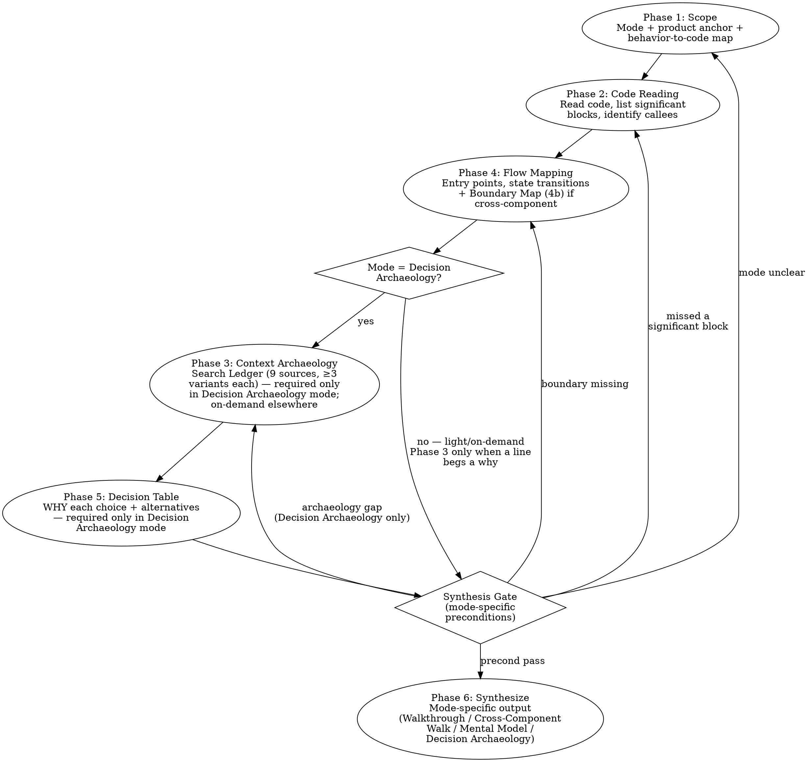

# Deep Understand

Produce deep understanding of existing code and systems — not just WHAT it does, but WHY it exists, HOW it got here, WHAT shaped its design, and (when asked) WALK the reader through every line and branch as if you are their IDE.

**Core principle:** Code is the artifact. Understanding it for someone else has two halves: (1) walking the actual code so the reader can reason with it without opening the IDE, and (2) when explicitly asked, the story behind why the code looks the way it does. Reading code tells you what and how; archaeology tells you why. Most asks need (1) only. When the user is not reading the code themselves, you must paste the actual code, anchor every claim in `file:line`, explain every non-trivial line in plain English, and recursively inline every callee — you are their eyes.

**Iron rules:**

1. **Match the mode the user asked for.** Default for "explain how X works" / "walk me through" is **Walkthrough**, not Decision Archaeology. Do not silently downgrade a walk into a summary, and do not silently upgrade a walk into a history lesson. State the mode in the first line of the response.
2. **Inline every callee, do not link.** A `file:line` reference without the quoted code in the response forces the user to open the IDE — defeating the entire reason the skill exists.
3. **No fabrication.** If you did not read it, you do not get to claim it. Use `UNKNOWN: <what>`.

## Output Modes — Detect Before You Deliver

Phase 1 → Phase 4 (and Phase 3 only when needed) build the raw material. Phase 6 delivers it in the right shape for the user's actual request. Detect the mode from the user's signals BEFORE writing the synthesis. Wrong mode = right facts wasted.

| Signal in the user's request | Mode | What you deliver in Phase 6 |
|---|---|---|
| "summarize", "give me the gist", "high-level", "mental model", "what's the shape of this" | **Mental Model** | 1–3 paragraphs of conceptual framing, then ask which slice to expand. Do **not** quote code unless asked. |
| "walk me through", "explain the flow", "trace it", "step through", "narrate", "I won't open my IDE", "go through the code with me", "read it to me", "explain every line", "explain what each method does" | **Walkthrough** *(primary, default for "explain how X works")* | Product anchor → Behavior-to-Code Map → quote every significant block → plain-English explanation of every non-trivial line → **recursively inline every callee** (helper, hook, service, util) right where it is referenced, with its own quote + explanation, until a framework / stdlib / external boundary → enumerate every branch arm → recap at every hop. Reader never needs to open the IDE. No git history. No "where to modify" guide unless asked. |
| "trace across repos / services / layers", "follow it into the backend / next service / lower layer", "from the UI all the way to the store", "connect the dots across `<component-A>` / `<component-B>`" | **Cross-Component Walk** | Walkthrough mode **plus** an explicit Boundary Map (Phase 4b) and a "where we are" recap after every repo / service / layer hop. |
| "why does this exist", "what's the story behind", "why was this built this way", "what shaped this", "history of this code", "what alternatives were considered" | **Decision Archaeology** | The exhaustive Search Ledger (Phase 3, all 9 sources) + decision table (Phase 5) + timeline of changes with motivation. This is the *only* mode where heavy archaeology is the deliverable; in other modes it is supporting work, not output. |
| Ambiguous | Ask one question: "Do you want a mental model, a line-by-line walkthrough, a cross-component trace, or the history of why it exists?" Default to **Walkthrough** when the request is "how does X work" or "explain X" without a clearer signal. |

**Mode binding rules:**

- The chosen mode applies to the **whole** response. Do not mix Mental Model framing into a Walkthrough request — the user explicitly asked for the code.
- Mode determines what is in the output AND how heavy the underlying work is. Walkthrough mode does Phase 3 lightly and on-demand; Decision Archaeology mode does the full Search Ledger. Do not over-invest in archaeology when the user just wants the flow, and do not under-invest in archaeology when the user explicitly asks "why was this built".
- State the mode as the first line of the synthesis: `**Mode: Walkthrough**` (or whichever applies). This makes the contract visible — the user can correct your mode pick before reading further.

## The Three Questions

Every investigation answers some subset of these three. The mode determines which dominate:

1. **What does the product do and where does the code live?** *(every mode — Walkthrough leads with this)* — What user-visible behavior, where is it triggered, and which file:line implements each step?
2. **How does it flow?** *(every mode — Walkthrough and Cross-Component Walk dominate here)* — What is the entry point? What data enters, transforms, exits at each step? What are the branches and state transitions? What does every named callee do?
3. **Why is it shaped this way?** *(Decision Archaeology lives here; other modes only when a line begs the question)* — What business problem, bug, edge case, or requirement motivated it? What alternatives were rejected? What constraints forced specific choices?

## Investigation Flow



## What Counts as "Significant" (No Cherry-Picking)

Phase 2, 3, and 5 require coverage of every **significant** block of code or design choice. Significant is not subjective — it is anything matching ANY of:

- Has a non-trivial branch (if/switch with >1 non-default arm, ternary chain, error path)
- Mutates external state (DB write, network call, global, ref, file system)
- Has explanatory comments, TODOs, HACKs, FIXMEs, WORKAROUND markers, or NOTE annotations
- Touches auth, permissions, billing, PII, partner gating, or feature flags
- Has a dedicated test or appears in a test name
- `git blame` shows >1 author or >2 modifications across its lifetime
- Is referenced by name in any PR, Jira ticket, design doc, or Slack thread you found
- Contains magic numbers, string literals that look like keys/IDs, or values whose origin is non-obvious

If any of those are true, the block is significant. Document the WHY for it. No skipping "obvious" ones — obvious to you ≠ obvious to the next reader, and "obvious" is exactly where wrong assumptions hide.

## Phase 1: Scope the Understanding

**Before touching code — understand what the user needs.**

### 1a: Goal scoping

Ask (one at a time, not all at once):

1. **What specifically?** — A function? A feature? A system? A cross-repo flow? Narrow the target.
2. **Why now?** — Are they modifying it? Onboarding? Reviewing? Debugging? This changes what depth and angle matters.
3. **What do they already know?** — Don't explain what they already understand. Build on existing knowledge.
4. **What output mode?** — Mental Model, Code Narration, or Cross-Repo Walk? (See Output Modes above.) If their phrasing already implies one, name it back to them and proceed.

If the user's request is already specific enough (e.g., "walk me through `shouldShowFormCard` line by line"), skip to Phase 1b — but still note the modify/onboard/review/debug angle, because it shapes the synthesis.

If the user asks for "quick" or "brief" understanding and the target is non-trivial, push back: deep-understand is exhaustive. Offer (a) narrowing the scope to one specific question, or (b) using a lighter skill. Do not silently truncate.

### 1b: Product Behavior Anchor

**Before any code — answer in plain product language**, even just one paragraph. "Product" here means whatever the system delivers: a UI feature, an API endpoint, a CLI command, a library function, a scheduled job, an embedded firmware behavior. The anchor is the same shape regardless of stack:

- **Trigger**: What initiates this behavior? (User clicks, request arrives, timer fires, event published, command invoked, sensor reading received.)
- **Observable response**: What does an external observer see? (UI changes, response payload returned, side effect emitted, log line written, signal sent, status changed.)
- **Outcome**: What is the durable result, if any? (Row written, message published, permission granted, navigation occurred, hardware state changed, nothing — pure read.)
- **Where it lives on the surface**: Which screen, endpoint, command, job name, topic, port, function signature would someone point at to find it?

If you cannot answer without inventing details, **stop and ask**, or consult whatever product documentation exists (spec, design doc, README, user manual, ADR, runbook, in-repo `docs/`), or run/observe the feature. Faking the anchor poisons every downstream phase — the code will look correct but you will not recognize behavior that violates intent.

**No assumptions rule:** If a piece of product behavior is not in the user's question, not in any doc you found, and not directly observable in code, you do not get to invent it. Mark it `UNKNOWN: <what is unknown>` and either resolve it later in the archaeology or call it out in synthesis.

**Exit gate:** You can state two sentences:
1. "User wants to understand [X] because [they're doing Y], in [mode]."
2. "In product terms: the trigger is [T]; the observable response is [R]; the outcome is [O]; the surface entry point is [S]."

### 1c: Behavior-to-Code Map (REQUIRED before code archaeology)

For every step you named in 1b, identify the **specific code that implements it** before you start reading deeper. This map is the spine of every later phase — it pins each piece of product behavior to a file/line/symbol that is the authoritative implementation, so when you walk the code in Phase 6 the reader never wonders "wait, which code matched the thing you just described?"

Build this table:

| Product step (from 1b) | Code location (`<repo>/<file>:<line>` or symbol) | Why this is the match | Confidence |
|------------------------|--------------------------------------------------|------------------------|------------|
| Trigger fires | `<repo>/<entry>:<line>` (`<symbol>`) | Found by `grep`/route table/handler registration/event subscription | high / medium / low |
| Observable response produced | `<repo>/<file>:<line>` | Returns the response / writes to UI / emits the signal | high / medium / low |
| Outcome persisted | `<repo>/<file>:<line>` | Performs the write / publish / state change | high / medium / low |

Rules for filling this map:

- One row per product step. If a step has multiple candidate implementations (overloaded, version-gated, feature-flagged), list all of them and mark `multiple — needs disambiguation`.
- "Why this is the match" must cite real evidence: a route registration, an event handler binding, a `grep` hit on the user-visible string, a function called by the trigger handler. Do not write "looks like it" — that is an assumption.
- If you cannot find code for a step, do not skip the row. Write `UNKNOWN — searched: <queries>`. The unknown is itself a finding; later phases may resolve it, or it survives into the synthesis as an explicit gap.
- The map is rebuilt — not erased — when archaeology in later phases corrects an entry. Strike through and add a footnote, do not silently overwrite, so the reader can see how understanding evolved.

**Exit gate:** Every product step from 1b has a row. Every row is either pinned to a `file:line` with evidence, or explicitly marked `UNKNOWN` with the queries tried.

## Phase 2: Code Archaeology

Read the actual code. Then read the history.

### 2a: Read the Code

1. **Find the code** — Grep/glob for the target. Read the actual implementation, not descriptions.
2. **Read callers** — Who calls this? What context provides the inputs?
3. **Read callees** — What does this call? What side effects?
4. **Read types** — What types constrain the inputs and outputs?
5. **Read tests** — Tests reveal intended behavior, edge cases the author knew about, and the contract.

### 2b: Read the History

```bash
# Who wrote this and when?
git log --follow -p -- <file>

# Original introduction
git log --diff-filter=A -- <file>

# Blame specific lines for authorship
git blame -L <start>,<end> <file>

# What changed recently?
git log --oneline -20 -- <file>

# Find the PR that introduced key changes
git log --grep="<keyword>" --oneline
```

For every significant block of code, know:
- **When** was it written?
- **Who** wrote it?
- **What commit message / PR title** describes the intent?
- **What changed** from the previous version?

**Exit gate:** You can describe what the code does, who wrote each significant part, and when. List of every significant block (per the criteria above) is enumerated — not a sample.

## Phase 3: Context Archaeology

### Mode gate (read this first)

The depth of this phase depends on the mode chosen in Phase 1a:

| Mode | Phase 3 requirement |
|------|---------------------|
| **Walkthrough**, **Cross-Component Walk** | *Light.* Use Phase 3 only when a specific line in the code begs a "why" the code itself does not answer (an unexplained magic number, a comment that points at a ticket, a guard whose motivation is non-obvious). Do not produce a Search Ledger by default. Do not surface git history, PR threads, ticket numbers, or commit timelines in the synthesis — the user did not ask for them. Run targeted single-source archaeology only for the specific unresolved questions, and only inline the finding where it explains a line. |
| **Decision Archaeology** | *Exhaustive.* The full Search Ledger below is required. This is the mode where archaeology IS the deliverable. |
| **Mental Model** | *Minimal.* Use Phase 3 only if the mental model cannot be stated honestly without one historical fact (e.g., "this exists because of a legacy migration"). Otherwise skip. |

**Never volunteer archaeology output in Walkthrough mode.** Git timelines, "what shaped it", "where to modify if you change this", and ticket references are NOT part of the Walkthrough deliverable — the user wants the flow, not the history. Offer them at the end as a separate "want me to dig into the history too?" follow-up.

### When Phase 3 is required (Decision Archaeology mode)

Code and git history tell you WHAT happened. Context archaeology tells you WHY.

### Hard gate: Exhaustive source enumeration (Decision Archaeology mode only)

The previous version of this skill said "at least TWO". That floor became a ceiling — agents stopped after two and produced shallow answers. Forbidden going forward in this mode.

**In Decision Archaeology mode you MUST attempt EVERY available source in the table below.** Not a subset. Not "the most likely two". Every one. The unsearched source is statistically where the contradicting fact lives — that is the entire reason this mode exists.

| # | Source | Tool | Required action |
|---|--------|------|-----------------|
| 1 | Git history (introduction commit + every modification) | `git log --follow -p`, `git blame`, `git log --diff-filter=A` | Read every commit message touching target. List authors. |
| 2 | PRs (every commit's PR + topic search) | `gh pr list --search`, `gh pr view`, `gh api repos/.../pulls/N/comments` | Read every PR description + review threads + inline comments. |
| 3 | Jira (every ticket referenced in commits/PRs + topic/feature/function-name search) | `searchJiraIssuesUsingJql`, `getJiraIssue` (whichever Jira MCP is available in the session) | Read ticket + parent epic + every comment. Capture acceptance criteria. |
| 4 | Confluence / design docs | Confluence search MCP (`searchConfluenceUsingCql` or equivalent) | Search by feature name, system name, every ticket ID found. |
| 5 | Quip | `mcp__claude_ai_Quip__search_documents`, `read_document` | Search by feature name, function name, every ticket ID found. |
| 6 | Slack / Glean / company knowledge search | Glean MCP (`search`, `chat`) or equivalent | Search by feature, function, ticket ID, error messages, author name. |
| 7 | Code comments and TODOs (target file + neighbors + callers/callees) | `grep -n "TODO\|HACK\|WORKAROUND\|NOTE\|XXX\|FIXME"` | Read every annotation. |
| 8 | Tests (target's tests + sibling tests + integration tests that exercise the path) | Read | Every test name + body — they encode the contract and the edge cases. |
| 9 | Related code (callers + callees + sibling implementations of the same pattern) | grep, read | Map relationships. Compare with similar code elsewhere. |

A row counts as **attempted** only when ALL three are true:

1. A real query was executed (not just contemplated).
2. The result was inspected — every hit if ≤10, top 10 + a sample of the rest if >10. "0 hits" is a valid result and you log it.
3. The query was varied if the first attempt returned nothing useful. Try at least 3 variants per source: ticket ID, feature name, function/symbol name, file path, related concepts. One-shot queries do not count.

If a tool is unavailable (MCP error, no auth, server down), you log the failure with the exact error, and you must still attempt the remaining sources. You may not skip the row — you mark it "unavailable: <reason>" and move on. Treat unavailability as a known limitation in the synthesis, not a permission to drop the source from consideration.

### Search Ledger (required artifact)

Build and maintain this table as you search. Phase 4 is **blocked** until the ledger has an entry for every row of the source table above. Show the ledger to the user (or include it in your internal scratchpad if it would clutter the chat) — but it must exist.

| Source | Query/queries used | Hits | Key findings | Status |
|--------|-------------------|------|--------------|--------|
| Git log | `git log --follow -p src/foo.ts` | 14 commits | RMS-1234 introduced; RMS-5678 fixed null crash | done |
| PR search | `gh pr list --search "shouldShowFormCard"`; `gh pr view 4521` | 3 PRs | #4521 added Standards gating | done |
| Jira | RMS-1234, parent EPIC-99, JQL `text ~ "form card"` | 4 tickets | Original requirement: hide cards for partial schemas | done |
| Quip | "form card visibility"; "shouldShowFormCard"; "RMS-1234" | 1 doc | Design decision rationale on partial schemas | done |
| Slack/Glean | `chat: "shouldShowFormCard rationale"`; `search: "RMS-1234"`; `search: "form card visibility"` | 0 | Nothing relevant | done (empty) |
| Confluence | `cql: text ~ "shouldShowFormCard"`; `text ~ "form card schema"` | 0 | Nothing relevant | done (empty) |
| Code comments | `grep -rn "TODO\|HACK\|WORKAROUND\|FIXME"` in module | 2 | TODO on alt-path edge case | done |
| Tests | `*.spec.ts` for target + siblings | 7 tests | Contract enumerated by test names | done |
| Related code | grep for similar pattern callers | 5 sites | Pattern reused in Records module | done |

Empty result ≠ skipped. An empty row is documented evidence that the source has nothing to add. That is itself a finding.

### What to look for in each source

- **Business requirement** — What did stakeholders ask for?
- **Bug report** — Was this a fix? What was broken?
- **Edge case** — What specific scenario forced this design?
- **Constraint** — What technical/business limitation shaped this?
- **Alternative considered** — What was rejected and why?
- **Timeline pressure** — Was this a quick fix intended to be temporary?
- **Author intent** — In their own words from PR, ticket, or Slack.

### Exit gate

For each significant block (per the objective definition above), you have either:

- An evidence-backed WHY: "This exists because [reason], documented in [source link]." OR
- An "exhausted, none found" with the Search Ledger as proof — every row attempted with ≥3 query variants.

Below that bar, "couldn't find" = "didn't try hard enough". Resume searching.

## Phase 4: Flow Mapping

Map how data flows through the system. For each component in the chain:

### Entry Points
- Where does execution start?
- What triggers this code path? (user action, API call, timer, event)
- Under what conditions is this path taken vs skipped?

### State Transitions
For each boundary between components, document:

```
[Component A] --→ [Component B]
  Input: { what data enters }
  Transform: { what changes }
  Output: { what data exits }
  Side effects: { state mutations, API calls, events emitted }
  Conditions: { when this path is taken }
```

### Key Questions at Each Boundary
- What assumptions does the receiving component make about its input?
- What happens if the input is unexpected (null, empty, wrong type)?
- Where are the error boundaries?
- What state is shared vs isolated?

**Exit gate:** You can trace any input from entry point through every component to final output, naming what transforms at each step. Every significant block from Phase 2 appears somewhere on the flow map.

### Phase 4b: Cross-Repo Boundary Map (REQUIRED when flow crosses repos/services/languages)

When the flow leaves one repo, service, language, or process and enters another, that boundary is the **single most likely place for bugs and misunderstandings to live** — field renames, type coercions, auth context loss, retry/timeout policy, error-code translation, schema drift. Enumerate every boundary explicitly. Do not assume "it's just a function call".

A boundary exists whenever ANY of these is true between two pieces of the flow:

- Different git repository
- Different runtime/process (client ↔ server, service A ↔ service B, worker ↔ queue)
- Different language (any pairing of compiled, interpreted, schema, query, or markup languages)
- Different transport (in-process call ↔ HTTP/RPC/queue/SQL/file/IPC/pipe)
- Different trust boundary (unauthenticated ↔ authenticated, internal ↔ external-facing, plaintext ↔ encrypted)

Build this table — one row per boundary, in the order data flows. The example below uses placeholders; replace them with the real artifacts you found.

| # | From (`<repo>/<file>:<line>`) | To (`<repo>/<file>:<line>`) | Contract artifact | Transport | Transform at boundary | Trust / scope delta |
|---|------------------------------|-----------------------------|-------------------|-----------|----------------------|---------------------|
| 1 | `<client-repo>/<entry>:<line>` | `<api-repo>/<schema-or-route>:<line>` + `<api-repo>/<handler>:<line>` | `<endpoint-or-mutation signature>` | `<HTTP / RPC / queue>` | `<rename / coerce / inject session>` | `<unauth → authenticated>` |
| 2 | `<api-repo>/<handler>:<line>` | `<service-repo>/<contract-def>:<line>` + `<service-repo>/<server-handler>:<line>` | `<RPC method signature or REST contract>` | `<gRPC / REST / queue>` | `<naming convention shift / id injection>` | `<session → service identity>` |
| 3 | `<service-repo>/<handler>:<line>` | `<datastore or downstream>` | `<SQL statement / event schema / API call>` | `<SQL / event / API>` | `<in-memory object → row / event payload>` | `<in-process → durable store>` |

For each boundary, the contract row MUST include:

- **The contract artifact** — schema fragment, RPC message, REST endpoint signature, SQL statement, queue message format, or event schema. Quote it verbatim from the actual repo (do not paraphrase, do not infer if a real artifact exists somewhere in the codebase — find it).
- **The transform** — what changes shape at this hop? Renames (camelCase ↔ snake_case, etc.), type widenings/narrowings, default values added, fields dropped or server-computed, identity injected.
- **Error translation** — how does a failure on the receiver side appear to the sender? Quote the actual error mapping in the code, do not assume one exists if you have not seen it.
- **What the receiver assumes** — auth context present, fields non-null, ordering, idempotency, retry-safety. If an assumption is implicit (no comment, no guard), call it out as implicit and flag the resulting risk.

**Exit gate:** Every cross-repo hop in the flow has a row. The contract artifacts are quoted (not paraphrased). The transform is named. You can answer: "If I send malformed payload at boundary N, where does the error surface and in what shape?"

## Phase 5: Decision Archaeology

For each significant design choice discovered:

1. **What was the decision?** — Describe the choice that was made.
2. **Why was it made?** — Business requirement? Bug fix? Performance? Compatibility?
3. **What alternatives existed?** — What else could have been done?
4. **Why were alternatives rejected?** — Technical limitation? Time pressure? Edge case?
5. **What are the consequences?** — What does this choice force downstream?
6. **Is this still the right choice?** — Has context changed since the decision was made?

### Escape hatch — narrow conditions only

You may write "no documented reasoning found" ONLY when ALL of:

- Search Ledger shows real attempts on every row (1–9).
- Each source was queried with ≥3 query variants (ticket ID, feature name, function/symbol name, file path, related terms).
- You searched commit messages of the original introduction commit AND each subsequent significant modification.
- You attempted to identify the author and checked their other commits/PRs from ±60 days of the change for context.
- You looked for sibling implementations of the same pattern elsewhere in the codebase that might explain the convention.

Below that bar, "couldn't find" = "didn't try hard enough". Keep searching.

When you do invoke the escape hatch, write it like this:
> "No documented reasoning found for [choice], despite Search Ledger showing exhausted attempts on all 9 sources (see ledger). Based on the code and timeline, likely motivated by [hypothesis] — but this is inference, not evidence."

**Never present inference as fact.**

## Synthesis Gate

Do **not** emit any answer, partial answer, or "here's what I think" until the gate for your chosen mode passes.

### Universal preconditions (every mode)

- [ ] Mode is chosen and will be declared as the first line of synthesis (`**Mode: <...>**`).
- [ ] Phase 1a scope statement written (one sentence: "user wants to understand `<X>` because `<Y>`, in `<mode>`").
- [ ] Phase 1b product-behavior anchor written (trigger / observable response / outcome / surface entry point), with any unknown explicitly marked `UNKNOWN`.
- [ ] Phase 1c behavior-to-code map built — every product step has a `file:line` or explicit `UNKNOWN — searched: <queries>`.
- [ ] Phase 2 list of every significant block enumerated (per the objective definition).

### Walkthrough / Cross-Component Walk — additional preconditions

- [ ] Phase 4 flow map drawn (entry → transitions → exit).
- [ ] Phase 4b boundary map filled in if and only if the flow crosses a repo/service/language/process boundary — every hop has its row, with the contract artifact quoted (not paraphrased), the transform named, and the trust delta noted.
- [ ] For every significant block, you have already located the file, read its body, and identified every in-codebase callee it references (so the recursive inline in Phase 6 can be complete, not improvised).
- [ ] No fabricated content — every claim is either grounded in code you read or labelled `UNKNOWN`.

### Mental Model — additional preconditions

- [ ] You can state the system's conceptual model in ≤3 paragraphs without quoting code.

### Decision Archaeology — additional preconditions

- [ ] Phase 2 history read for every significant block (when, who, what changed, why per commit message).
- [ ] Phase 3 Search Ledger has an entry for every row 1–9, status `done` or `unavailable: <reason>`.
- [ ] Phase 3 each ledger row used ≥3 query variants (or documented why fewer were possible).
- [ ] Phase 5 decision table complete — every significant choice has WHY + evidence link, OR explicit escape-hatch invocation backed by ledger.

Skipping a gate item for your mode produces an answer that fails the user. Do not negotiate this with yourself. The user gets a useless response faster — that is not a win.

## Phase 6: Synthesize

Open with the mode you are in. Literally write the first line: `**Mode: <Walkthrough | Cross-Component Walk | Mental Model | Decision Archaeology>**`. This makes the contract visible and prevents accidental mode-mixing under length pressure.

Then deliver per mode.

---

### Mode A — Walkthrough (default for "explain how X works") and Cross-Component Walk

This is the dominant case. The user is not looking at the code. **You are their IDE.** Your job is to put the actual code in front of them and explain it so completely they do not need to open the file.

The Walkthrough output has a fixed shape — follow it in order:

**1. Product anchor (1 paragraph).**
From Phase 1b. Trigger → observable response → outcome → surface entry point. Plain product language. No code, no file names yet.

**2. Behavior-to-Code Map (table).**
From Phase 1c. Each row pins one product step to the file:line that implements it, with a confidence tag. This is the spine — every block in the walk below sits on a row of this table.

**3. The walk (the body — most of the response).**
For every significant block (per the objective definition above), in execution order, produce a block with all seven of these elements. Missing any of them = walkthrough failed.

> **Block template:**
>
> **a. Locate.** Heading line: ``[<short purpose>] <repo>/<path>/<file>.<ext>:<line-start>-<line-end>``. The short purpose is one phrase ("entry handler", "auth guard", "filter normalizer"). Never omit the file:line.
>
> **b. Quote.** Paste the actual code verbatim in a fenced code block. Match the source's whitespace and line breaks. If the block is longer than ~30 lines, split into sub-blocks with their own walks rather than truncating.
>
> **c. Per-line plain-English narration.** Walk the code top-to-bottom. Every non-trivial line gets a one-sentence explanation in your own words. Trivial lines (imports of a name you have already explained, closing braces, simple assignments of literals already explained) can be grouped, but never "..the rest is obvious". Use the format `Line N: <what this line does>` or a short bullet list keyed by line numbers — anchor every claim to a line.
>
> **d. Inline every callee recursively.** Whenever the quoted block references a non-trivial named symbol (function, hook, method, helper, util, service, component) that is defined inside the codebase, **stop and inline that symbol's definition right here**: locate + quote + narrate it before you move on. Then if THAT body calls another in-codebase symbol, inline that one too. Continue until you hit a leaf — a framework/library/stdlib call (`useState`, `fetch`, `time.Now`, `json.Marshal`, `Array.prototype.map`) or an obvious primitive. State the leaf and what it returns in one sentence, do not expand further. The reader must never see a name that is referenced but not shown.
>
> **e. Enumerate every branch arm.** For every `if/else`, `switch`, ternary, early return, `try/catch`, error path, or guard, list every arm — including the unwritten else. Say what happens in each arm, including which downstream block (if any) it leads to. Do not collapse multiple arms into "etc."
>
> **f. Connect.** Say in one or two sentences how this block hands off to the next block in the flow ("the resolved value at line N is passed to `<next-symbol>`, which we walk next"). At a cross-component boundary, point at the Boundary Map row and the contract; do not silently cross a process / language / repo line.
>
> **g. Edge / unknown call-out.** Anything non-obvious about this block — empty input behavior, retry semantics, side effects, hidden coupling — gets one bullet. Anything the code does not answer and you have not researched gets a `UNKNOWN: <question>` bullet. Never fabricate an explanation; surface the gap.

**4. "Where we are" recap (Cross-Component Walk only).**
Every time the walk crosses a repo / service / language / process / transport boundary, stop and write a 3-bullet recap:
- What just happened (in product terms, not code terms)
- What state changed (memory, request, persistent store, external system)
- What we are about to walk next (the file:line on the receiving side, naming the boundary contract)

**5. End-of-flow summary.**
After the last block, one short paragraph that retraces the whole flow in product-action-shaped sentences ("the user clicks X → the client validates Y → the server checks Z → the store writes W → the response surfaces back as V"). One line per hop.

**What Walkthrough mode does NOT contain (unless the user asks):**

- No git history, commit list, author table, blame output.
- No PR / ticket references.
- No "What Shaped It" / "Why this design" historical narrative.
- No "Where to poke if you want to modify" / "if you change X then Y breaks" guide.
- No "What alternatives were considered".
- No design critique unless asked.

These belong in **Decision Archaeology** mode and clutter a walkthrough request. At the end of the walk you may offer them as a single one-line follow-up: "Want me to also dig into the history / how to modify it safely?"

---

### Mode B — Mental Model

1–3 paragraphs only. Conceptual framing — "here's how to think about this system". Analogies welcome. The reader should be able to reason about behavior without reading any code. Do not quote code. Do not list files. At the end, offer the walkthrough as the next step: "Want me to walk through the actual code?"

---

### Mode C — Decision Archaeology

This is the original archaeology-heavy delivery. Produce in this order:

1. **Mental Model** (1–3 paragraphs).
2. **Why It Exists** — the business problem, the bug or requirement that motivated the code, in non-code terms.
3. **What Shaped It** — timeline of major changes with motivation for each, evidence-linked to the Search Ledger from Phase 3. Every claim either cites a source or is labelled inference per the escape hatch.
4. **Alternatives Considered & Rejected** — for each significant decision, what else was on the table and why it lost.
5. **Edge Cases and Gotchas** — non-obvious behavior, "looks wrong but is intentional", "looks intentional but is accidental".
6. **If You're Changing This** — caller assumptions, test coverage, blast radius, landmines.

This is the only mode where Phase 3's full Search Ledger is required. Skipping the ledger in this mode is failing the mode.

---

### Cross-cutting rules (apply in every mode)

- **No assumptions.** Never invent a behavior, line, callee, contract, or design rationale. If you have not seen it, you have not seen it. Use `UNKNOWN: <what>` or "not seen in the code I read" — explicit, never implicit.
- **Inline, do not link.** A `file:line` reference without the actual code quoted in the response is a regression to "you must open your IDE". The skill exists to remove that step.
- **Explain, do not list.** A list of callees without explanations is the failure mode the user explicitly named. Every named symbol must be either expanded inline OR called out as a leaf.
- **Match modes to signals, then state the mode.** If the user signaled walkthrough, do walkthrough. If they signaled archaeology, do archaeology. Mixing wastes their time and yours.

### Tailor depth to goal (within the chosen mode)

| User goal | Emphasize inside the mode |
|-----------|---------------------------|
| **Modifying** (Walkthrough mode) | Linger on guards, branches, edge cases, side effects. Inline tests if they exist. |
| **Onboarding** (Walkthrough or Mental Model) | Spend longer on product anchor + behavior-to-code map. Prefer shallower but broader walks. |
| **Reviewing** (Decision Archaeology) | Decisions and alternatives weighted highest. |
| **Debugging** (Walkthrough) | State transitions and error paths weighted highest. Every catch / error return enumerated. |

## Rationalization Table — STOP if You Think These

### Walkthrough-mode failures (the user is reading via you)

| Excuse | Reality |
|--------|---------|
| "The file:line reference is enough — they can open it" | The skill exists because they will not open it. Quote the lines inside the response. |
| "Just naming the helper is enough — its purpose is obvious from the name" | A name describes intent at best, not behavior. Inline the helper's body and explain it. |
| "I'll quote the code but skip the per-line narration — the code speaks for itself" | If it spoke for itself, the user would not have asked. Narrate every non-trivial line. |
| "The rest of the function is obvious" | "Obvious" is exactly where the bug lives. Walk it. |
| "Recursing into every callee will make the response huge" | Yes. That is the point — the response replaces the IDE. Cut by tightening prose, not by dropping callees. |
| "This callee is in node_modules / stdlib so I can ignore it" | Correct — but say so in one line ("`fetch` is the browser primitive that issues the HTTP request"). Do not silently elide it. |
| "I should add a git timeline / history table since I have the info" | Not unless the user asked. In Walkthrough mode, history is noise. Move it to a follow-up offer. |
| "I should add a 'where to modify' guide while I'm here" | Not unless the user asked. Walkthrough delivers the flow, not the change plan. |
| "I'll paraphrase the code in my own words instead of quoting" | Paraphrase = forces the user to trust your paraphrase without seeing the source. Quote first, then paraphrase. |
| "Two repos are very similar, I'll summarize them together" | Each repo speaks a different language and contract. Walk each one. Boundary-skipping is where understanding silently breaks. |
| "Cross-component contract is implicit / obvious" | Contracts are the boundaries where bugs live. Make them explicit (Phase 4b). |

### Archaeology-mode failures (only relevant in Decision Archaeology mode)

| Excuse | Reality |
|--------|---------|
| "Found enough sources to answer" | Enough ≠ all. The unsearched source is statistically where the contradicting fact lives. Keep going. |
| "Diminishing returns from more searches" | You do not know what you would find until you search. Predicting empty without querying is guessing. |
| "Other sources unlikely to have anything" | Unlikely ≠ zero. Run the query, log empty, move on. Cost: 30 seconds. |
| "I'll fill the gap with reasonable inference" | Inference presented as fact = lying to the user. Either find evidence or label inference explicitly per the escape hatch. |
| "Two sources agree, that's enough" | Two sources can both be wrong (copy-paste, shared author, propagated assumption). Triangulate from independent sources. |
| "Phase 3 is taking too long" | In Decision Archaeology mode, Phase 3 IS the work. Skipping it = delivering a useless answer faster. |
| "Newest commit explains it" | Newest = current state. Original introduction + intermediate changes explain WHY it evolved into the current state. Read all. |
| "Author left the company / unavailable" | Their PRs, tickets, chat history, design docs persist. Search them. Their absence is not your excuse. |
| "Already wrote a draft mental model in my head" | Drafted before ledger complete = wrong. Erase. Build the model on evidence, not the reverse. |
| "I'll skip the empty rows in the ledger" | Empty rows are evidence. The ledger is a contract with the reader that you actually looked. Skipping = lying. |
| "One query variant per source is fine" | One keyword = one angle. The fact you missed lives at a different angle. Run ≥3. |
| "Tests don't count as a source" | Tests encode the contract and the edge cases the author cared about. They count. Read them. |

### Mode-selection failures (any mode)

| Excuse | Reality |
|--------|---------|
| "User asked 'how does X work' — close enough to 'why' — I'll do Decision Archaeology" | Default for "how does X work" is **Walkthrough**. Switch to archaeology only on explicit history / why-was-this-built signals. |
| "User said 'walk me through' but I'll start with a 1000-word mental model first" | They explicitly asked for the walk. Open with the walk. Mental model is at most one sentence in front, or skipped. |
| "User just wants a quick summary, I'll silently downgrade" | If they wanted a summary, they said so. Match the requested mode. If unsure, ask one question. |
| "It's clear from context, no need to confirm the mode" | "Clear from context" is exactly the assumption that turns out wrong. State the mode in the first line of synthesis so the user can correct it. |
| "I'll fill the gap with reasonable inference" | Inference without label = lying. Use `UNKNOWN: <what>` or the escape hatch. |
| "I should re-read the user's request later" | Re-read it now. Mismatched mode wastes the whole response. |

## RED FLAGS — Stop and Course-Correct

### Walkthrough-mode red flags

| Red flag | What to do |
|----------|-----------|
| Named a function/helper/component but did not quote its body | Stop. Inline the callee right where it was referenced. Quote + narrate before continuing. |
| Quoted a code block without per-line narration | Stop. Walk every non-trivial line in plain English before moving on. |
| Used `file:line` as a hyperlink-style reference without quoting the code | Stop. Paste the actual code in a fenced block in the response itself. |
| Skipped a branch arm ("the rest is obvious", "etc.", "and similar cases") | Stop. Every arm of every branch must be enumerated, including the unwritten else. |
| Stopped expanding callees before hitting a framework / stdlib leaf | Resume the recursive inline. Only frame­work / stdlib / external symbols are leaves. |
| Surfaced git history / PR / ticket info that the user did not ask for | Move it to a single one-line follow-up offer at the end. Walkthrough mode is not archaeology. |
| Wrote a "Where to modify" / "if you change X then Y" section unprompted | Drop it. Walkthrough is not a change plan. Offer it as a follow-up. |
| Crossed a repo / service / language boundary without naming the contract | Resume Phase 4b. Make the boundary explicit before the next block. |
| Made any claim about behavior, contract, or callee you have not directly seen | Replace with `UNKNOWN: <what is unknown>` or remove. Never fabricate. |
| Walkthrough does not open with the product anchor and behavior-to-code map | Stop. Add them at the top. The walk is grounded in product behavior, not in vibe. |

### Mode-selection red flags

| Red flag | What to do |
|----------|-----------|
| First line of synthesis does not declare the mode | Add `**Mode: <...>**` as the first line. Make the contract visible. |
| Answering a different question than the user asked | Resume Phase 1a. Re-read the user's actual question. |
| User asked for a walk; you delivered a summary | Discard the summary. Rewrite as Walkthrough. |
| User asked for history / "why was this built"; you delivered only a flow walk | Switch to Decision Archaeology mode and produce the ledger + decision table. |
| User pushed for "quick" on a non-trivial target | Tell them this skill is exhaustive within the mode. Offer (a) narrowing the scope, or (b) a lighter skill. Do not silently shortcut. |

### Archaeology-mode red flags (Decision Archaeology only)

| Red flag | What to do |
|----------|-----------|
| Explaining WHAT code does without WHY (in archaeology mode) | Resume Phase 3 — Search Ledger. |
| No external sources checked | You skipped Phase 3. Resume. Build the Search Ledger from scratch. |
| Search Ledger has fewer than 9 rows attempted | Stop. Resume Phase 3 until every row has a status. |
| Any ledger row marked `done` without a real query in the row | Lying to yourself. Run the query. Update the row with actual evidence. |
| Used same single keyword for every source | Vary queries — ticket ID, feature name, function name, file path, related concepts. ≥3 variants per source. |
| "I think the reason is..." without evidence | Label as inference per the escape hatch, only if Search Ledger is exhausted. Otherwise keep searching. |
| Cherry-picked easy decisions, skipped hard ones | Re-list significant blocks objectively (per the criteria). Force a WHY for every one. |
| Started writing decision narrative before Synthesis Gate passed | Stop writing. Finish the gate checklist. The narrative is wrong without it. |

## When External Sources Are Unavailable (Decision Archaeology mode)

If you cannot access ticket systems, chat search, design-doc tools, or other external knowledge stores during a Decision Archaeology run:

1. **Say so explicitly, per source** — "`<source-name>` unavailable in this session: `<error>`." One line per unavailable source.
2. **Still attempt every available source.** Unavailability of one source does not excuse skipping the others.
3. **Mark unavailable rows in the Search Ledger as `unavailable: <reason>`** — they remain in the ledger, not deleted. The ledger is a record of what was attempted, including failures.
4. **Maximize what you have** — git history, PR descriptions, code comments, README/in-repo docs, test names, related code patterns.
5. **Label inference clearly** — "Based on the commit timeline and PR title, this appears to be motivated by `<X>` — but I have not verified with the original ticket because `<source>` was unavailable."
6. **Tell the user what to verify** — "To confirm, look at `<ticket-id>` in `<ticket-system>`, or ask `<author>`."

Unavailability is a documented limitation, not a permission to deliver shallow understanding.

## Mode-aware quick reference

| Mode | Phase 1 | Phase 2 | Phase 3 | Phase 4 | Phase 5 | Phase 6 output |
|------|---------|---------|---------|---------|---------|-----------------|
| **Walkthrough** | Full (incl. anchor + behavior-to-code map) | Full | Light, on-demand only | Full flow + 4b if cross-component | Inline only when a line begs a "why" the code does not answer | Mode line → anchor → map → quoted+narrated blocks with inlined callees → end-of-flow summary |
| **Cross-Component Walk** | Full | Full | Light | Full + Boundary Map (4b) mandatory | Inline only as above | Walkthrough output + recap per hop |
| **Mental Model** | Full | Read enough to anchor the framing | Skip unless one historical fact is load-bearing | Skim | Skip | 1–3 paragraphs, offer walk as follow-up |
| **Decision Archaeology** | Full | Full | Full Search Ledger (all 9 sources, ≥3 variants each) | Full | Full | Mental model → Why → What Shaped It → Alternatives → Edge cases → If You're Changing |

## Related Skills

- **deep-investigate** — Use when the goal is to find and fix a bug, not to understand a system. Deep-investigate proves causation; deep-understand builds mental models / walkthroughs.
- **brainstorming** — Use when the goal is to design something new. Deep-understand is for understanding what already exists.
- **context-save** — Checkpoint deep-understand findings during long sessions. The Behavior-to-Code Map and (when in Decision Archaeology mode) the Search Ledger are what should be persisted.
